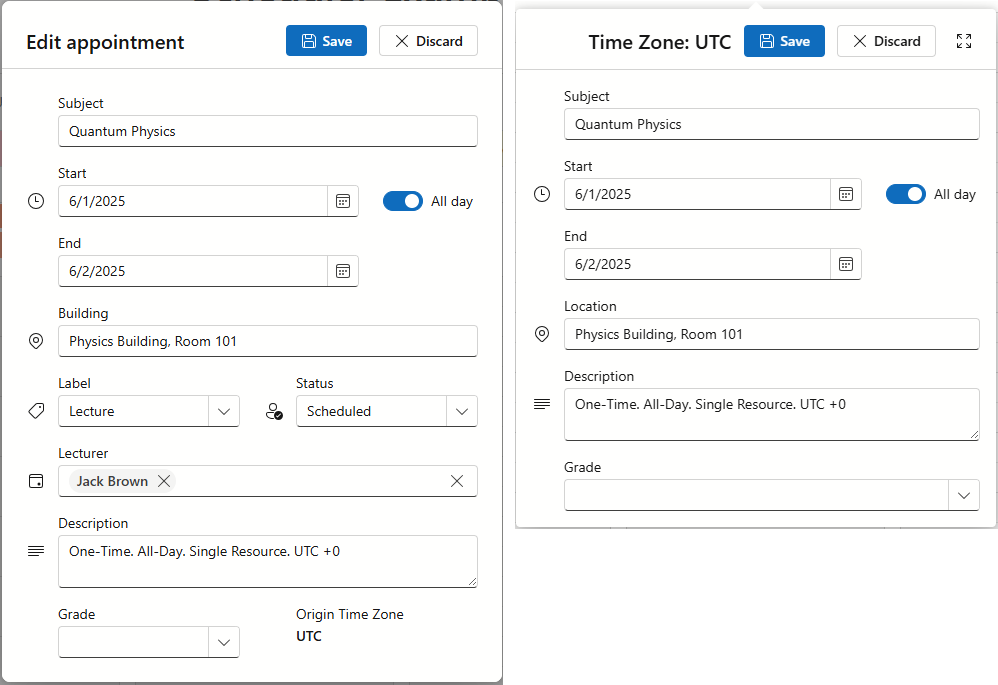

<!-- default badges list -->

<!-- default badges end -->
# Blazor Scheduler - Customize Appointment Form

This example creates custom extended and compact appointment forms for DevExpress Blazor Scheduler. In addition to standard content, custom forms display appointment time zone and have a custom layout item -- **Grade**.

Refer to the following help topic for information on how to create custom appointment forms: [Custom Appointment Forms and Tooltips](https://docs.devexpress.com/Blazor/404564/components/scheduler/customization/appointment-forms-and-tooltips#custom-appointment-form).

Like our standard appointment forms, customized forms support CRUD operations (see [Index.razor.cs](/CS/DxBlazorApplication1/Components/Pages/Index.razor.cs)). For your convinience, we created a data source that contains different appointment types (one-time, all day, and recurrent) distributed between resources. Refer to the following folders review our implementation: 

* [Models](/CS/DxBlazorApplication1/Models/) 
* [Services](/CS/DxBlazorApplication1/Services/)

## Files to Review

- [Index.razor](/CS/DxBlazorApplication1/Components/Pages/Index.razor)
- [Index.razor.cs](/CS/DxBlazorApplication1/Components/Pages/Index.razor.cs)

## Documentation

- [Custom Appointment Forms and Tooltips](https://docs.devexpress.com/Blazor/404564/components/scheduler/customization/appointment-forms-and-tooltips#custom-appointment-form)

## More Examples

- [Load appointments for visible interval only (lazy loading)](https://github.com/DevExpress-Examples/blazor-scheduler-load-appointments-range)
- [Implement CRUD operations with a Web API Service](https://github.com/DevExpress-Examples/blazor-scheduler-bind-to-web-api-service)

<!-- feedback -->
## Does this example address your development requirements/objectives?

 

(you will be redirected to DevExpress.com to submit your response)
<!-- feedback end -->

